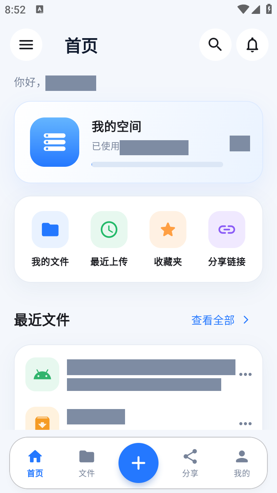
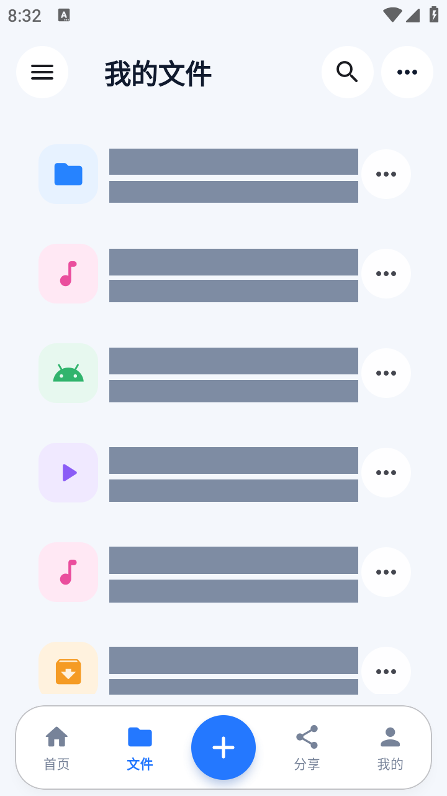
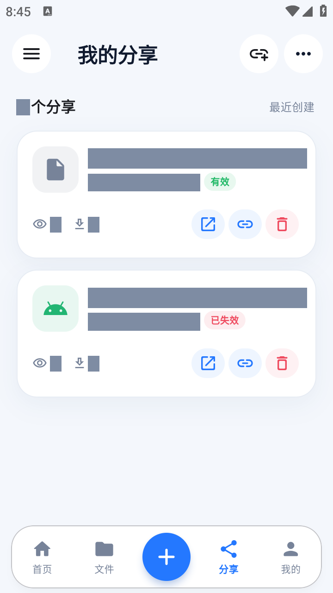
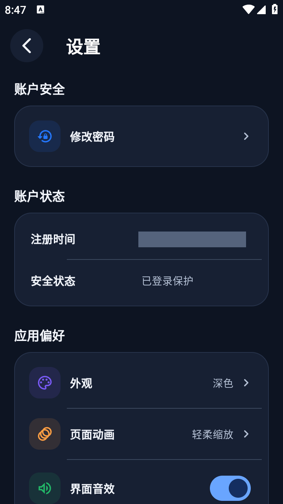

# Cloudreve Android

一个面向 **Cloudreve v4** 的非官方 Android 客户端，使用 Flutter 构建，提供文件管理、分享转存和原生音视频播放。

主要界面与文件、账户操作通过原生 Flutter 页面和 Cloudreve API 实现，并非网页套壳。音频使用 `just_audio`，视频使用 `media_kit`；部分文档预览仍会调用内置浏览器或外部应用。

当前维护与回归验证以 **Android + Cloudreve v4 API** 为主。本仓库提供客户端源码，不包含 Cloudreve 服务端、存储节点或媒体转码服务；目前尚未发布本仓库修改版的正式安装包。

## 界面预览

以下为 Android 构建验证时的界面截图，用于展示界面布局与主题。

| 首页 | 我的文件 | 我的分享 | 深色设置 |
| --- | --- | --- | --- |
|  |  |  |  |

## 功能

| 模块 | 已实现内容 |
| --- | --- |
| 文件管理 | 列表 / 网格布局、排序、弹窗搜索、新建目录、重命名、删除、多文件上传、下载及进度展示 |
| 分享与转存 | 创建、复制和撤销分享链接；粘贴链接导入；转存时选择保存目录 |
| 媒体播放 | 图片缩放；顶栏音频播放与队列控制；独立视频播放器、倍速、全屏锁定、亮度与音量手势 |
| 账户 | 添加与切换服务器、登录 / 退出、注册验证、昵称与头像修改、密码修改 |
| 偏好设置 | 浅色 / 深色 / 跟随系统主题、页面切换动画、界面音效开关、账户状态与应用信息 |
| WebDAV | 查看连接信息、管理 WebDAV 访问账户 |

### 使用边界

- **服务端适配**：注册验证、权限、配额、分享和下载行为受服务器版本与配置影响；不承诺兼容所有 Cloudreve 版本和第三方修改版。
- **分享转存**：只支持当前已登录服务器的同源分享链接，不支持跨站转存。剪贴板中的新链接只自动提示一次，也可以手动粘贴。
- **文档与压缩包**：PDF、文本、代码等文件尝试通过浏览器预览，显示效果取决于浏览器和服务端响应；ZIP 预览会先下载完整文件，再展示包内目录，不是解压管理器。不支持的格式可下载后交给外部应用。
- **音视频**：能否播放取决于实际编码、设备、文件和网络条件；识别扩展名不代表支持该格式的全部编码组合。客户端不提供服务端转码。
- **缓存**：目录、搜索和部分请求使用有容量上限的内存缓存，并合并重复请求。搜索结果优先复用，在应用内文件变更或主动刷新后失效，也可能因容量淘汰或应用重启而清除；网页端的文件变更可能需要手动刷新。这不是离线同步或服务端实时推送。
- **平台与未完成部分**：WebDAV 页面不提供系统级挂载，离线任务相关遗留页面尚未完整实现。仓库中的 iOS、桌面和 Web 平台目录不代表已完成适配与验证。

## 开始使用与开发

### 环境要求

- Flutter **3.47.2**，固定版本见 [`.fvmrc`](.fvmrc)；使用随 Flutter 提供的 Dart SDK，项目约束为 `^3.13.0`。
- JDK **17**、Android SDK 与 Android SDK Command-line Tools。
- Node.js **20+**，用于构建包装命令和仓库检查，不是 Android 应用的运行依赖。
- Python / OpenAPI Generator 仅在重新生成 API 客户端时需要。

准备好工具链与 Android 真机或模拟器后：

```sh
git clone https://github.com/chin9933/cloudreve-android.git
cd cloudreve-android
flutter doctor -v
flutter pub get --enforce-lockfile
flutter run
```

仓库处于私有状态时，克隆需要相应访问权限。请保留并提交根目录 `pubspec.lock`，不要为了绕过构建错误随意升级原生播放器依赖。

### 连接网盘

默认应用名称为 `Cloudreve`，示例包名为 `com.example.cloudreve`，**不预设服务器**。首次打开后，在登录页添加自己的 HTTPS Cloudreve 站点，再使用该站点的账户登录；是否允许注册由服务器控制。

应用不内置维护者的个人部署信息、生产账户或签名密钥。已有服务器选择和登录会话不会因构建参数改变而被强制重置。

## 构建与应用信息定制

### 配置文件

复制 [`config/app.example.json`](config/app.example.json) 为 `config/app.local.json`，按需修改公开应用信息：

```json
{
  "APP_NAME": "Cloudreve",
  "APP_APPLICATION_ID": "com.example.cloudreve",
  "APP_DESCRIPTION": "安全存储 · 随时访问 · 轻松分享",
  "CLOUDREVE_SITE_URL": ""
}
```

`CLOUDREVE_SITE_URL` 留空表示不预设服务器，填写时使用 HTTPS 地址。开发运行可读取这份配置：

```sh
flutter run --dart-define-from-file=config/app.local.json
```

这些参数会进入 APK，**不能用于保存密码、令牌或密钥**。`config/*.local.json` 默认由 Git 忽略。配置优先级、版本号及更多示例见 [构建配置说明](docs/BUILD_CONFIGURATION.md)。

### Android APK

Windows 可通过命令定制名称、包名、简介、默认站点和版本，无需修改源码：

```bat
tool\build_android_release.cmd --app-name "团队云盘" --application-id com.example.teamdrive --app-description "团队文件管理" --site-url https://cloud.example.com --build-name 1.2.0 --build-number 12 --split-per-abi --online
```

也可以读取配置文件：

```bat
tool\build_android_release.cmd --config config/app.local.json --split-per-abi --online
```

- `--split-per-abi`：按处理器架构分别生成 APK，避免安装无关架构的原生库。
- `--online`：允许 Gradle 下载依赖；包装脚本默认使用离线缓存，首次构建通常需要此参数。
- `--dry-run`：仅校验并显示构建配置，不生成 APK。
- `--help`：查看完整参数。上述命令不会替换应用图标。

**正式 release 构建必须配置签名**：按照 [发布检查清单](docs/RELEASE_CHECKLIST.md) 设置本地 `android/key.properties` 或受保护的签名环境变量，不要提交密钥与密码。准备好签名和配置文件后，也可直接使用 Flutter：

```sh
flutter build apk --release --split-per-abi --dart-define-from-file=config/app.local.json
```

没有正式签名、仅做本地验证时，Windows 包装脚本可显式允许测试签名：

```bat
tool\build_android_release.cmd --split-per-abi --online --local-test
```

产物位于 `build/app/outputs/flutter-apk/`。**测试签名 APK 不是正式发行包**，不能与正式签名混用。覆盖升级需要保持相同包名和签名；更换包名会安装为另一个应用。

## 开发检查

提交前运行：

```sh
node tool/check_repository.mjs
node --test tool/build_android_test.mjs
dart format --output=none --set-exit-if-changed lib test
dart analyze --fatal-infos
flutter test --no-pub
```

需要修正格式时运行 `dart format lib test`。Windows 也可使用 `tool\pub_get.cmd` 和 `tool\check_project.cmd`；工具链查找支持 `FLUTTER_ROOT` 与 PATH。

[GitHub Actions](https://github.com/chin9933/cloudreve-android/actions) 会执行仓库检查、构建脚本测试、格式检查、静态分析、Flutter 测试及 Android debug 构建。CI 不访问生产账户、不使用正式签名密钥，也不自动发布 APK；具体结果以对应提交的工作流记录为准。

## 项目结构与文档

| 路径 | 内容 |
| --- | --- |
| `lib/app/`、`lib/view/` | 启动、认证、导航和业务页面 |
| `lib/component/`、`lib/theme/` | 公共控件、播放器与主题 |
| `lib/state/`、`lib/utils/` | 会话、播放状态、API 仓储、缓存和平台桥接 |
| `lib/config/`、`config/` | 应用元数据与构建配置示例 |
| `api/`、`api_docs/`、`openapi/` | 生成的 API 客户端、协议说明和生成输入 |
| `test/`、`tool/` | 回归测试、构建和检查脚本 |
| `outputs/` | 本地日志、截图和诊断产物，忽略提交 |

- [架构与约定](docs/ARCHITECTURE.md)
- [构建配置](docs/BUILD_CONFIGURATION.md)与[发布检查清单](docs/RELEASE_CHECKLIST.md)
- [代码质量检查记录](docs/CODE_QUALITY.md)与[更新记录](CHANGELOG.md)
- [参与开发](CONTRIBUTING.md)与[安全问题报告](SECURITY.md)

## 许可状态

当前尚未为整个派生项目确定统一的开源许可证，因此不声明 MIT、Apache 或 GPL 授权。第三方代码、字体、图标和原生库分别遵循其自身许可，参见 [第三方声明](THIRD_PARTY_NOTICES.md)；正式公开发行前需明确适用许可。

## 项目来源

本项目基于 [YangChengxxyy/cloudreve_flutter](https://github.com/YangChengxxyy/cloudreve_flutter) 继续开发，保留上游提交历史，并在此标注原项目来源。感谢原作者提供基础实现。

本仓库在原项目基础上继续完善了 Cloudreve v4 接口适配、Android 界面、账户与文件操作、分享转存、原生音视频播放、缓存及构建检查流程。
